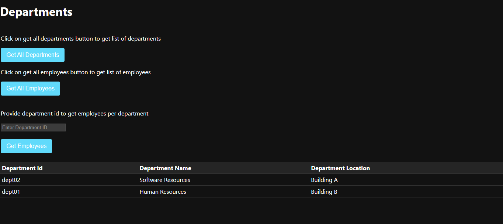
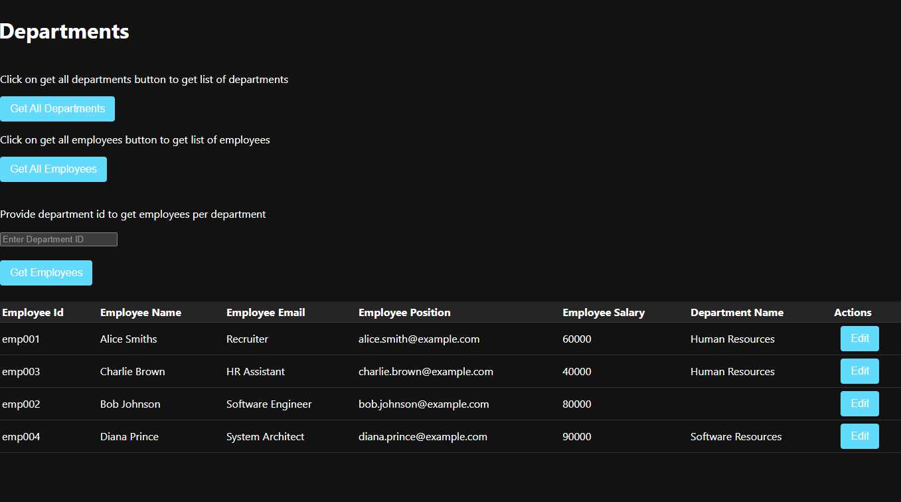
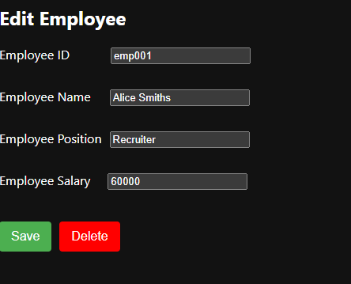
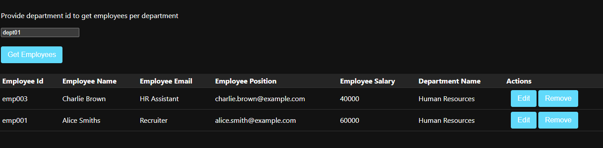

# Employee & Department Management App
This is a simple Spring Boot application with a React frontend that manages employees and departments. The main design rule is that one department can have multiple employees.

## TECHSTACK
* Java Spring boot
* React
* REST API's
* H2 Database
* Apache Tomcat Server

## Entities
Department
Represents a department in the organization.

## Employee
Represents an employee working in the organization.

## API Endpoints
### Employee
* GET /employees: Retrieve information about all employees.

* GET /employees/{employeeId}: Retrieve information about a specific employee.

* PUT /employees/: Update information for a specific employee.

* POST /employees: Create a new employee.

* PATCH /employees/{employeeId}: Partially update information for a specific employee.

* DELETE /employees/{employeeId}: Delete a specific employee.

* GET /employees/: Retrieve information about all employees.

### Department
* GET /departments: Retrieve information about all departments.

* GET /departments/{departmentId}: Retrieve information about a specific department.

* PUT /departments/: Update information for a specific department.

* POST /departments: Create a new department.

* PATCH /departments/{departmentId}: Partially update information for a specific department.

* DELETE /departments/{departmentId}: Delete a specific department.

* GET /departments/all: Retrieve information about all departments.

* GET /departments/{departmentId}/employees: Retrieve information about all employees in a specific department.

* POST /departments/addEmployeeToDepartment/{departmentId}/{employeeId}: Add an employee to a specific department.

* POST /departments/deleteEmployeeFromDepartment/{departmentId}/{employeeId}: Delete an employee from a specific department.

### Example URLs
Retrieve all employees in a specific department: http://localhost:8080/departments/dept01/employees

Add an employee to a department: http://localhost:8080/departments/addEmployeeToDepartment/dept01/emp003

Delete an employee from a department: http://localhost:8080/departments/deleteEmployeeFromDepartment/dept02/emp002

### UI Screenshots
* Click on get all departments to see list of departments

* Click on get all employees to see list of employees

* Click on Edit employee where you can edit/delete the employee

* Give a department number, where you can see employees per dept

* You can edit the employee or remove the employee from department in above screen.
* Pending features from UI
  * Add an employee 
  * Add a department
  * Add an employee to department